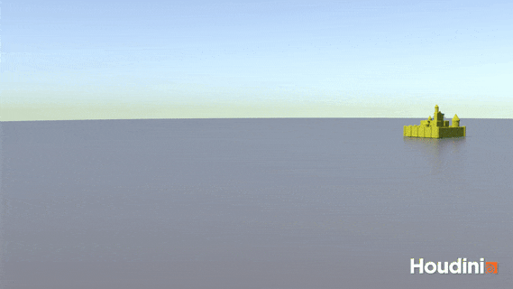
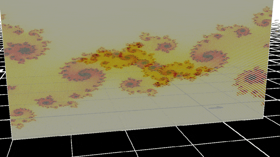
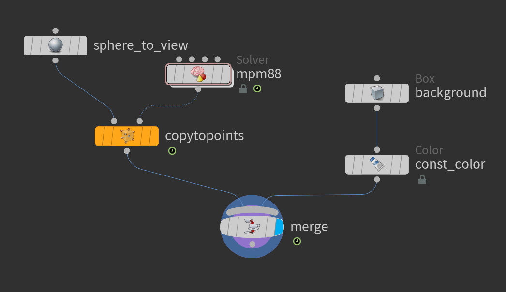
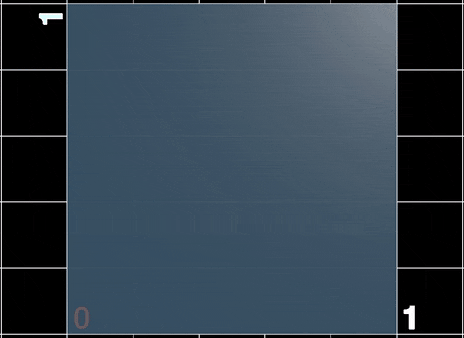
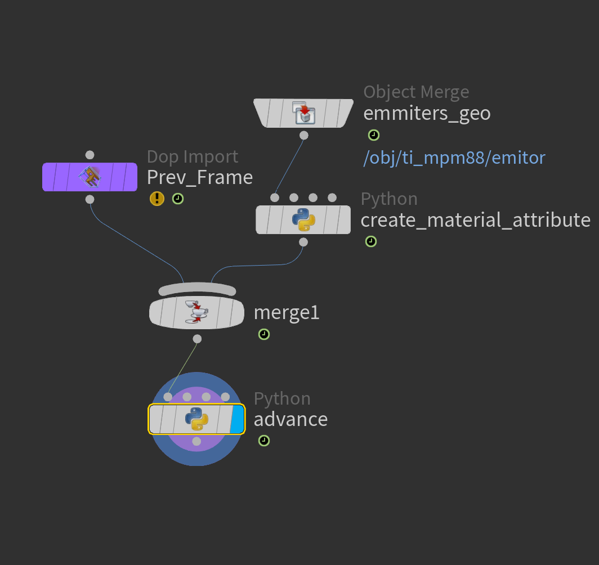
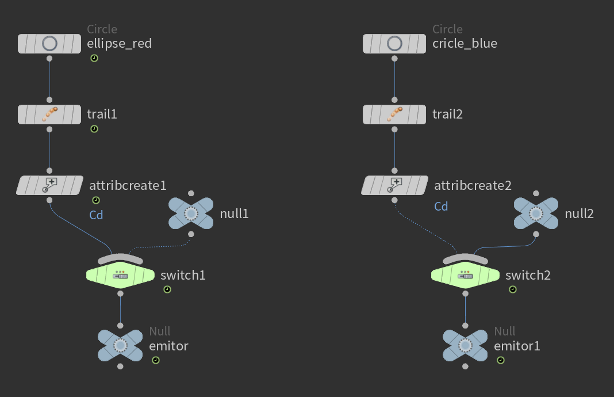
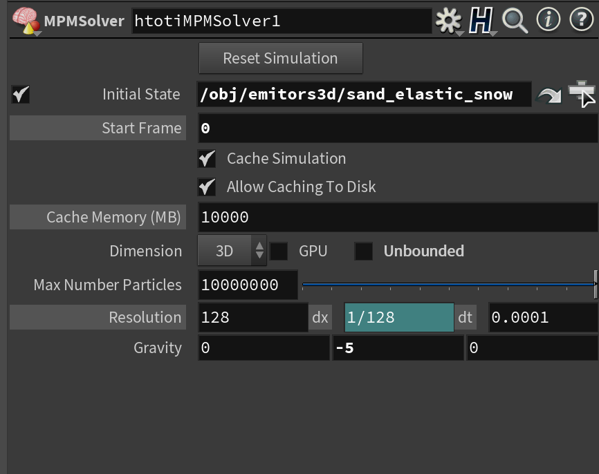
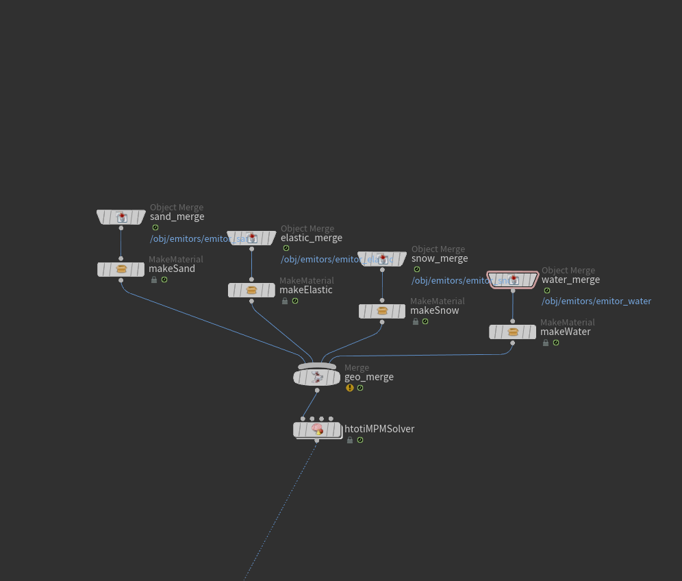
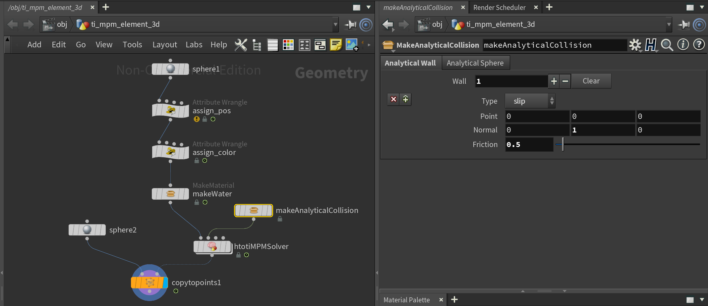

# Houdini To Taichi(htoti) Element

This repository is for embedding the existing [taichi-element](https://github.com/taichi-dev/taichi_elements), a High-Performance Multi-Material Continuum Physics Engine, as a Houdini extension. So that you can benefit from both flexibility for preprocessing via Houdini and the high performance via the ti engine.

<a href="Examples/mpm_element_castle.hipnc"></a>

<a href="Examples/mpm_element_ti_logo.hipnc"></a>

## Installing this plug-in
This plug-in only supports **the Python3 versioned Houdini >=17.5**. First, make sure to init the submodule to keep the same track of the (possible) customized edition of ti-element.

```shell
git submodule update --init
```


### Houdini "plug-in" method

Houdini will automatically create a preference folder upon your 1st launch. On Linux, this folder is `$Home/houdini_version_number`. On windows, this folder is `$USER/Documents/houdini_version_number`. We will dive into this folder and install a JSON configuration file.

- Create a folder named `packages` (if not existed) in your Houdini preferences folder.
- Copy the htoti.json file in this directory into the packages folder.
- Edit the variable $htotiLib to the `Libs` folder of this repo.

### Installing packages  under the Houdini directory
If you would like to manage the packages in the Python shipped with Houdini, follow the steps below.

- Linux
```shell
cd path_install_houdini/python/bin
python3 -m pip install --upgrade taichi
```
On Linux, you may encounter problems when importing packages in Houdini's Python because your the system Python's version is different, consider [creating a virtual environment](Misc/virtual_python_environment_linux.md).

- Windows
Navigate to the installation directory of Houdini, and dive into the Python folder (i.e. python37). In the case pip.py doesn't exist, you need to [download pip](https://bootstrap.pypa.io/get-pip.py) first, then open the windows terminal in this folder and type

```shell
python3.7.exe get-pip.py
python3.7.exe -m pip install --upgrade taichi
```

### Use Taichi in the Houdini Python shell
You can use Taichi in Houdini just like in any other normal Python shell. Try the following in any Python shell in your Houdini.
```python
import taichi as ti
ti.init()
from fractal import fractalClass
f = fractalClass(512)
f.draw()
```

If you open the [fractal.py](Libs/python/fractal.py), you will find that the only thing we did is to pack an existing taichi demo solver into a ti_data_oriented class, but leaving a parameter for the front-end, in this case, the Houdini, to set. You will find that the whole project is behind the idea that we combine the flexibility of Houdini and the performance of Taichi, merely with more parameters to set, and optimizations for the sake of performance.

You can see how to replicate this in Houdini by [Examples/fractal.hipnc](Examples/fractal.hipnc), although it's super slow and you might have noticed that taichi inits every frame. This is because Houdini losses the handler of the `fractalClass` every frame it re-executes the solver SOP, and we have to re-import or init() the taichi to avoid stack overflow. We discuss the solution in the later section.

<a href="https://github.com/yuanming-hu/taichi_houdini/blob/DOC/Examples/fractal.hipnc"></a>

## Introduction to the MPM plug-in

### MPM 88 and the ideas behind the plug-in

The fractal solver doesn't need the information of the previous frame to push forward the simulation, meaning it's a perfect demo for SOP cooking only. But to let the solver remember the previous frame information (and all finished frames), we also need help from the Built-in [SOP Solver](https://www.sidefx.com/docs/houdini/nodes/dop/sopsolver.html) of Houdini.

Navigate to the  [mpm88](Examples/mpm88.hipnc), click into the geometry node you will see below.

<a href="Examples/mpm88.hipnc"></a>

Magic, the previous frames are remembered and used to push the simulation correctly. Don't panic, we will break down gradually. The above overall network says we are showing a constant colored background, and many small spheres to visualize the particles yield by the solver, easy.

Click into the solver, you find out that we create some physical properties, then merge the incoming, newly emitted particles into the existing particles, and somehow re-obtain the handler and let the ti-end knows the current state and advance. The emitors are merely points on 2 rotating ellipses which we believe you have 1,000 ways to create. The physical properties, for the mpm88 solver, are just 2 point attributes: Jp and C, hence can be created simply by the Python SOP or point wranglers.



All combined, it's working. Nonetheless, it is worthy of mentioning that this implementation is neither efficient nor compatible. 1. Just like the fractal example, to let the ti-solver knows the current state, it ti.init() every frame, creating a new solver class, the re-fill all the data from the NumPy array, which is super slow. 2. The emitor and the material-maker are inside the solver and can't be edited easily. We solve these in our HToTi-MPM solver.

Overall, the above procedure defines the simplest form of **any htoti solvers**: 1. a solver is written in taichi, packed as a ti.data_oriented class with proper parameter settings and APIs; 2. an SOP Solver node containing the proper python scripts to use the ti solver, re-obtain the data, and advance the simulation; 3. handling the input of emitors or other geometry SOP nodes to define the scene change before the solving, and 4. the external material-makers the solver to create necessary attributes for the simulation.

### HToTi-MPM asset
In our HToTi-MPM asset, we solve the ti.init() problem by making MPM_solver_shell objects inside the module. When Python imports this module for the 1st time, these objects are materialized and kept in cache while Houdini is running. Hence, for every frame, we only need to re-fill the particle information, saving time for compiling and allocating memory.

We also move the emitors and colliders to be 2 external assets and connect them to the inputs of the solver SOP. Every frame, the solver SOP will read the updated emitors and colliders and refresh the corresponding settings. This procedure decouples the geometry editing and the solver's advancing and utilizes Houdini's flexibility. 

### Selecting parameters in the solver

The parameter interface of the solver lets you adjust global parameters such as dimension, resolution, dx, and gravity. It also lets you select the initial particles.

<a href="Examples/mpm_element_3d.hipnc"></a>

### Making the materials, Editing the emitors in Houdini, FREELY

Material-Maker is an independent, packed SOP node, whose sole purpose is to create point attributes for all the points of the incoming node's geometry. We have made 4 selectable materials: 1. elastic, 2. water, 3. sand and, 4. snow.

The emitors are going to the 0th input of the solver. You can enjoy the 100% flexibility brought by Houdini and just merge the particles before feeding into the solver's 0th input. In the below demo, we can easily control the timing for different emitters by [the parameter expressions](https://www.sidefx.com/docs/houdini/network/expressions.html) and the Houdini Built-in Switch nodes.

<a href="Examples/mpm_element_2d.hipnc"></a>

### Adding analytical collisions

The analytical collision goes to the 1st input of the solver. We have made the analytical planes(walls) and the analytical spheres. We are looking forward to contribution concerning box, tets, moving analytical collisions, and generalized SDF-based collisions.

<a href="Examples/mpm_element_sphere.hipnc"></a>

### Saving the cooked results via the ROP_geometry node

A quick tip from the Houdini side is to save your cooked results and do the post-processing later. We show below an example of the acid rain balls crashing at our planet. Do protect the environment!

<a href="Examples/mpm_element_earth.hipnc"></a>

## Known issues

- **Editing a connected MPMSolver node will not update the hda.** If you would like to contribute to **this hda,** always remember to sync your update to an unlocked, isolated htotiMPMSolver node after testing well, then lock and save it.
- **Reseting the simulation or modifying the SOP network before the MPM solver.** This operation will dramatically slow down the following solving, try to save all the modifications then, restart Houdini.
